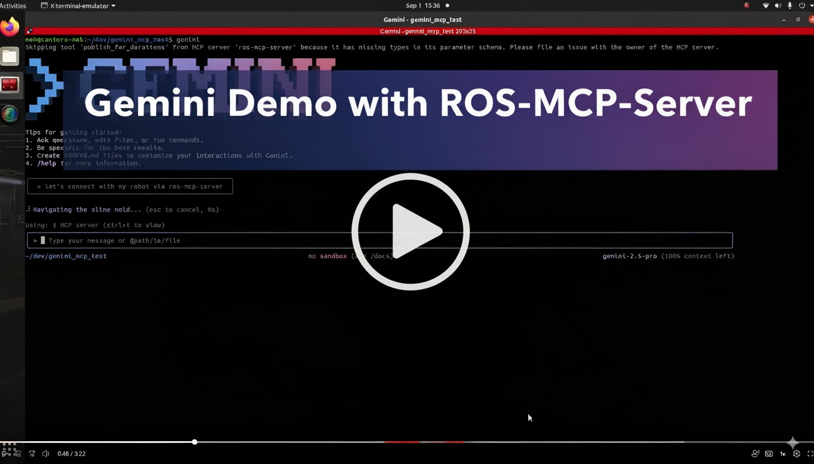

# Demo, Gemini-CLI with ROS-MCP-Server

## Prerequisite
- Installation of Gemini-CLI. [https://github.com/google-gemini/gemini-cli]
- Installation of ROS or ROS2. Test if ROS is installed by running Turtlesim. If you are not sure, follow, this toturial [https://wiki.ros.org/ROS/Tutorials]
- Installation of Rosbridge and ROS-MCP-Server [https://github.com/robotmcp/ros-mcp-server/blob/main/docs/installation.md]

## Tutorial Video 

