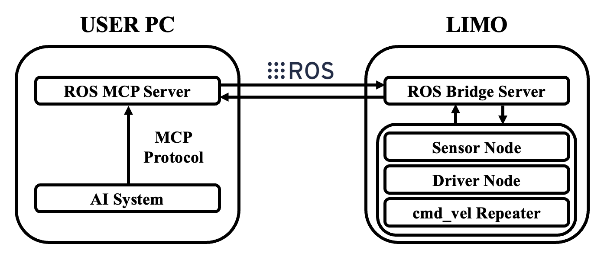
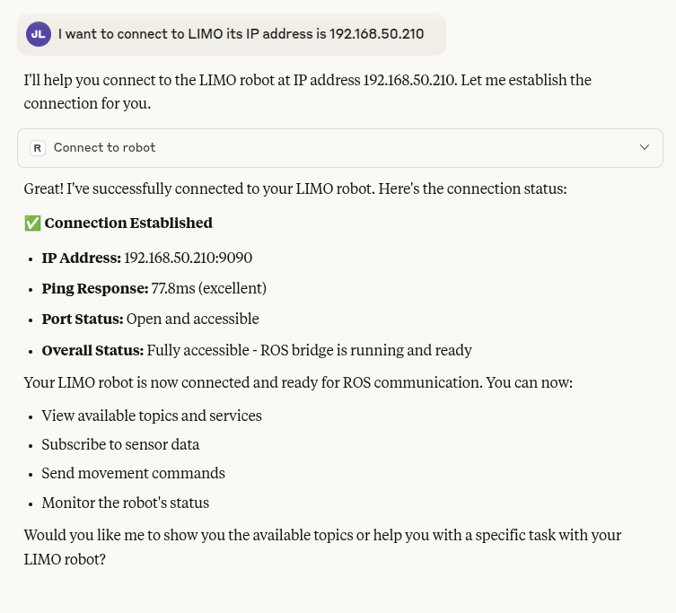

# Example - LIMO (Real)


This is an example using the real robot, AgileX Robotics LIMO, in the ROS ecosystem.

The LIMO is a ROS-based mobile robot platform for education and research, offering features like SLAM and navigation on various hardware configuration.
## Prerequisites

For this example, the LIMO Standard version with Ubuntu 18.04 and ROS1 Melodic is used. Since each LIMO variant comes with different vision sensors, LiDAR sensors, and ROS versions, make sure to install the corresponding packages required for your specific model.


### AgileX LIMO
For more details, please refer to the [LIMO Documentation](https://docs.trossenrobotics.com/agilex_limo_docs/).


- **Specification**
    - **OS** : Ubuntu 18.04
    - **ROS** : ROS1 Melodic
    - **IPC** : NVIDIA Jetson Nano (4G)
    - **Vision Sensor** : Dabai U3
    - **LiDAR** : EAI X2L


<br>
Before starting this tutorial, make sure you have the following installed. It is recommended to use a single workspace. If they are already installed, you may skip this step.

<br>

- **Limo SDK (ROS1)** : [LIMO SDK](https://github.com/agilexrobotics/limo_ros)
- **Ydlidar Ros Driver** : [Ydlidar Ros Driver](https://github.com/YDLIDAR/ydlidar_ros_driver)
- **Ros Astra Camera** : [ROS Astra Camera](https://github.com/orbbec/ros_astra_camera)


## **Framework**
The AI system communicates with the ROS-MCP via the MCP protocol, which connects through ROSbridge to LIMO's ROS nodes. ROSbridge converts ROS messages to JSON format over WebSocket, while the nodes handle topics to conrol hardware and exchange data.



## Quick Start

### 1. Network Setup

Since the LIMO is controlled via an ROS-MCP from the user PC, it is important to connect both the user PC and the LIMO to the same network.
- **Ping Test**
    
    After connecting them to the same network, perform a ping test from the user PC to LIMO to verify that the connection is established correctly: 
    
    ```bash
    ping <LIMO_IP>   # e.g., ping 192.168.0.20
    ```
    
- **ROS Network setup**
    
    In ROS1, nodes must know which host runs the ROS master. 
    
    On the LIMO, set the `ROS_MASTER_URI` environment variable:
    
    ```bash
    echo "export ROS_MASTER_URI=http://<LIMO_IP>:11311" >> ~/.bashrc
    echo "export ROS_IP=<LIMO_IP>" >> ~/.bashrc
    source ~/.bashrc
    ```
### 2. SSH Setup

For convenience in file transfer, SSH (Secure Shell) is enabled on the robot before setup.

- **SSH server installation on the LIMO:**

    ```bash
    sudo apt update
    sudo apt install openssh-server
    ```

- **Service activation:**
    ```bash
    sudo systemctl enable ssh
    sudo systemctl start ssh
    sudo systemctl status ssh
    ```
    If it shows `active (running)`, it means the service is running properly.

- **Connect to Robot on the user PC:**

    `<ROBOT_NAME>` is the robot's username (default: agilex), and `<LIMO_IP>`is the robot's network IP address, which you can find using the `ifconfig` command on the LIMO.
    ```bash
    ssh <ROBOT_NAME>@<LIMO_IP> # e.g., ssh agilex@192.168.0.20
### 3. File Upload
After connecting via SSH, the following commands are executed on the user PC.


- **Set helper node (`cmd_vel` repeat node):**
    

    On the LIMO, `cmd_vel` is consumed and applied to the motors immediately. This makes it hard to execute ROS-MCP generated motion commands accurately, since the ROS-MCP may not publish at a steady high-frequency rate. To compensate, a helper node is added that re-publishes the last command at a fixed frequency. 

    To ensure the ROS-MCP can use the topic unambiguously, the motor's input is remapped from `cmd_vel` to `cmd_vel_to_motor`, and configure the repeater to subscribe to `cmd_vel` (from the ROS-MCP) and republish it to `cmd_vel_to_motor`.
            
    ```bash
    cd /<ABSOLUTE_PATH>/ros-mcp-server
    scp ./examples/limo/scripts \
        <ROBOT_NAME>@<LIMO_IP>:~/catkin_ws/src/limo_base
    ssh <ROBOT_NAME>@<LIMO_IP> \
        "chmod +x ~/catkin_ws/src/limo_base/scripts/cmd_vel_repeat.py"
    ```
            
- **Replace launch file:**
            
    ```bash
    cd /<ABSOLUTE_PATH>/ros-mcp-server
    scp ./examples/limo/launch/limo_base.launch \
        <ROBOT_NAME>@<LIMO_IP>:~/catkin_ws/src/limo_base/launch/
    scp ./examples/limo/launch/limo/limo_start.launch \
        <ROBOT_NAME>@<LIMO_IP>:~/catkin_ws/src/limo_bringup/launch/
    ```
            
### 4. Launch Node
To use the robot's topics in ROS-MCP, each node is launched on the robot.
- **Start the base driver:**
    
    ```bash
    roslaunch limo_base limo_start.launch
    ```
        
- **Start the Camera (DaBai U3):**
    
    The LIMO standard uses Astra’s DaBai U3 depth camera.
    launch the cam node:
    
    ```bash
    roslaunch astra_camera dabai_u3.launch
    ```
    
- **Start the `cmd_vel` repeater:**
    
    ```bash
    rosrun limo_base cmd_vel_repeat.py
    ```
    
- **Start rosbridge:**

    ```bash
    roslaunch rosbridge_server rosbridge_websocket.launch
    ```
## **Integration with MCP Server**
    
Once rosbridge is running on the LIMO and your PC is on the same network, you can connect the MCP server to control the robot. If you haven’t set up the MCP server yet, follow the [installation guide](https://github.com/robotmcp/ros-mcp-server/blob/main/docs/installation.md) .
    
Since The ROS-MCP to recognize the robot, configure it to connect to the robot’s IP address.

## **Example Walkthrough**
After connecting to the robot, you can inspect which topics the robot subscribes to and what it can do.

### **Example 1** : Connect to robot



### **Example 2** : What can you do?


### **Example 3** : Simple Movement


## **Next Steps**

1. **Try running the navigation demo** 

    With the SLAM and navigation fratures provided by LIMO, more complex tasks can be carride out.

2. **Try more complex commands**

    The LIMO is equipped with various sensors, such as vision and LiDAR sensors. Let's make use of them.