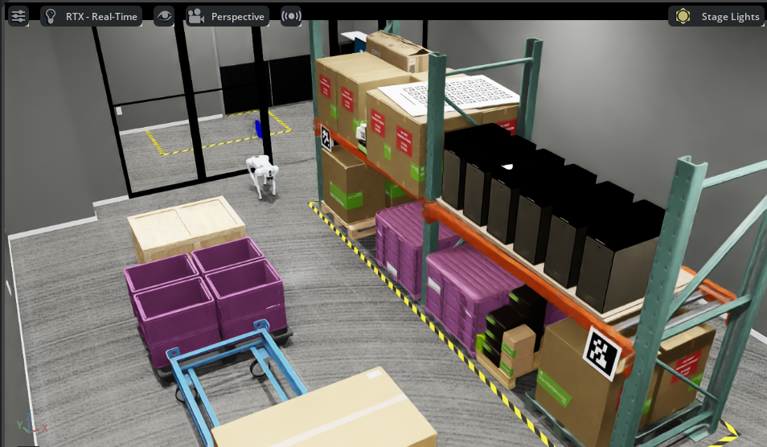
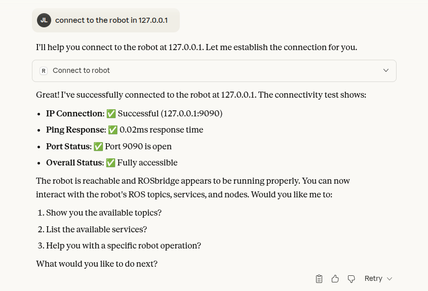
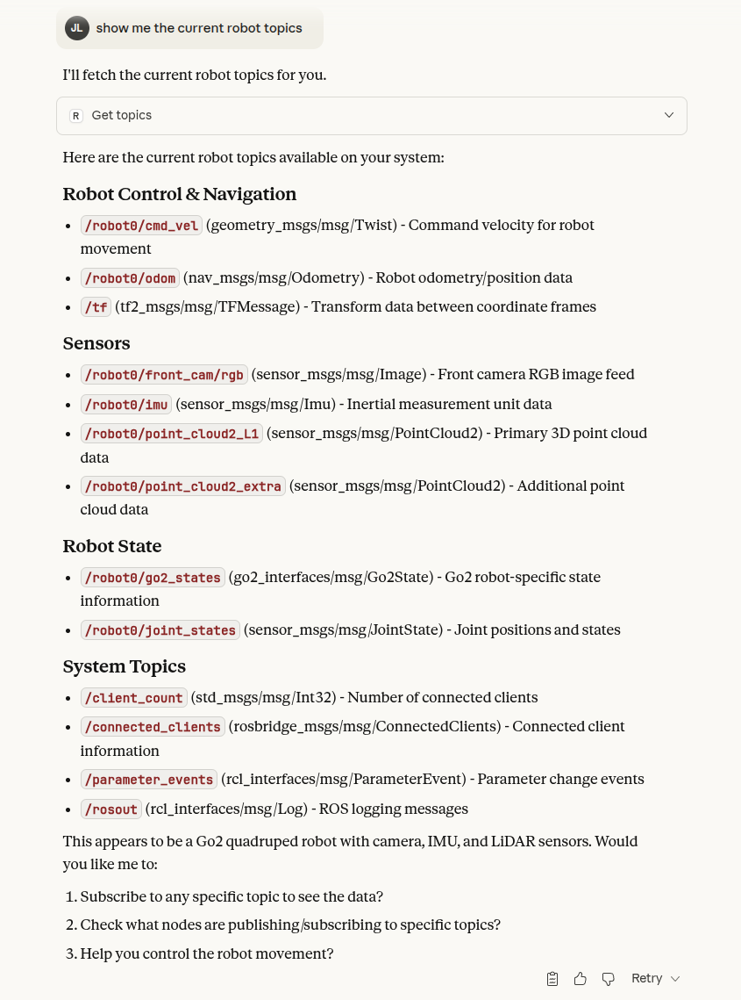
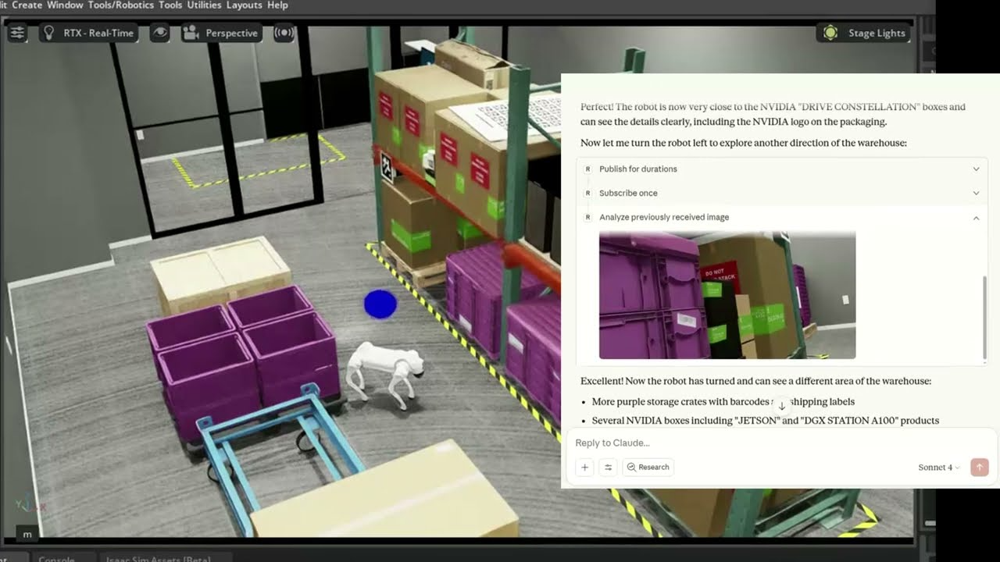

# Example - Unitree GO2 (Isaac Sim)

[](https://docs.omniverse.nvidia.com/isaacsim/latest/overview.html)
[](https://docs.python.org/3/whatsnew/3.10.html)

This example is built on the [go2_omniverse](https://github.com/abizovnuralem/go2_omniverse/tree/added_copter?tab=readme-ov-file) repository by @abizovnuralem. The repo enables seamless integration with ROS 2, giving access to various sensors such as LiDAR, IMU, and cameras, and allows you to easily leverage the locomotion model trained in Isaac Lab.
Using this setup, an environment is built to test and demonstrate the capabilities of ROS-MCP in the Isaac Sim.

## System Requirements
 This example requires a PC that meets the minimum specifications to run Isaac Sim. Please refer to the [System Requirements](https://docs.isaacsim.omniverse.nvidia.com/4.5.0/installation/requirements.html) to prepare the appropriate hardware.


## Prerequisites
✅ **Note:** This example is designed to run on Linux with ROS2 installed and has been tested on the following versions:  
- **OS**: Ubuntu 22.04  
- **ROS2**: Humble  
- **Isaac Sim**: 4.5.0
- **Isaac Lab**: 2.1.1 (recommmended)
  

Before starting this example, make sure you have the following installed:
- **ROS2** : [Install ROS2](https://docs.ros.org/en/dashing/Installation/Ubuntu-Install-Binary.html)
    

## Quick Start
### 1. IsaacSim & IsaacLab install in conda environment

Follow the instructions on the [Isaac Sim & Isaac Lab installation](https://isaac-sim.github.io/IsaacLab/v2.1.1/source/setup/installation/pip_installation.html) to install the Isaac Sim and Isaac Lab.

To avoid potential conflicts when working locally, it is recommended to work within a **conda** environment.

### 2. Environment Setup
Isaac Sim simulation environment for running the robot.

✅ **Note:** In this step, the process is based on the [go2_omniverse](https://github.com/abizovnuralem/go2_omniverse/tree/added_copter?tab=readme-ov-file) repository. See its README for more details.

- **Downloading the code**

    This example uses the **added_copter** branch, which is built on Isaac Sim 4.5.0.

    ```bash
    git clone -b added_copter https://github.com/abizovnuralem/go2_omniverse/ --recurse-submodules -j8 --depth=1
    ```
- **Setup the RTX Lidar**
    
    1. First check the directory of the virtual environment where Isaac Sim was installed:

        ```bash
        conda info --envs
        ```
    2. Update the Isaac Sim extension definition file to include the Unitree L1 lidar:

        ```bash
         cp /<ABSOLUTE_PATH>/ros-mcp-server/examples/4_unitree_go2/isaac_sim/scripts/extension.toml \
             <YOUR_CONDA_ENV_DIR>/lib/python3.10/site-packages/isaacsim/exts/isaacsim.sensors.rtx/config/
        ```
    3. Add the Unitree L1 lidar config file to Isaac Lab repo folder:

        ```bash
        mkdir -p <YOUR_CONDA_ENV_DIR>/lib/python3.10/site-packages/isaacsim/exts/isaacsim.sensors.rtx/data/lidar_configs/Unitree

        cp /<ABSOLUTE_PATH>/go2_omniverse/Isaac_sim/Unitree/Unitree_L1.json \
            <YOUR_CONDA_ENV_DIR>/lib/python3.10/site-packages/isaacsim/exts/isaacsim.sensors.rtx/data/lidar_configs/Unitree/
        ```
- **Custom Environment setup**
    
    To effectively showcase the capabilities of ROS-MCP, the small warehouse environment proivided by Isaac Sim was used, and the setup was configured to allow users to start using ROS-MCP right away.

    

    To set up the environment, several files in go2_omniverse need to be replaced with the files provided in this repository.

    ```bash
    cd /<ABSOLUTE_PATH>/ros-mcp-server/examples/4_unitree_go2/isaac_sim/scripts
    cp custom_rl_env.py omniverse_sim.py /<ABSOLUTE_PATH>/go2_omniverse/
    ```

    Finally, in the `run_sim.sh` file of go2_omniverse, add `--custom_env small_warehouse` to the Python execution command.
    
### 3. Launch

To use the robot's topics in ROS-MCP, each node is launched.

1. First, launch the simulation node.

    
    ```bash
    #Launch simulation node
    cd /<ABSOLUTE_PATH>/go2_omniverse/
    ./run_sim.sh
    ```
2. After that, open a new terminal and start rosbridge.

    ```bash
    # Launch rosbridge
    ros2 launch rosbridge_server rosbridge_websocket_launch.xml  
    ```    
3. You can verify the available topics for the Go2 robot by running the ros2 topic list command.
    
    ```bash
    ros2 topic list
    ```
    

    The key topics serve the following functions:

    - `/robot0/cmd_vel` : Transmits movement commands for the robot.
    - `/robot0/front_cam/rgb` : Transmits raw image data collected from the robot's camera.
    - `/robot0/point_cloud2_L1` : Publishes point cloud data from the Unitree L1 LiDAR.
    - `/robot0/point_cloud2_extra` : Publishes point cloud data from the extra simulated LiDAR. (If the extra sensor is not needed, it is recommended to disable its publishing.)

## **Integration with MCP Server**

If rosbridge is running, you can connect the MCP server to control the robot. If you haven’t set up the MCP server yet, follow the [installation guide](https://github.com/robotmcp/ros-mcp-server/blob/main/docs/installation.md) .

## **Example Walkthrough**
Once all the above connections are completed, you can connect to and control the Go2 robot from the **ros-mcp-server**. Below is an example screen showing the connection to the Go2 robot from the **ros-mcp-server**.

### **Example 1** : Connect to robot



### **Example 2** : Check available topics




### **Example 3** : Move around and observe ([video](https://www.youtube.com/watch?v=9StFx4lnvmc))

<a href="https://www.youtube.com/watch?v=9StFx4lnvmc"></a>


## **Troubleshooting**
- ### **CUDA Driver failures(RTX lidar issue)**
    ```bash
    [Error] [omni.sensors.nv.lidar.lidar_core.plugin] CUDA Driver CALL FAILED at line 522: the provided PTX was compiled with an unsupported toolchain.
    [Error] [omni.sensors.nv.lidar.lidar_core.plugin] CUDA Driver CALL FAILED at line 548: named symbol not found
    ```

    1. First, refer to the [Isaac Sim known issues](https://docs.isaacsim.omniverse.nvidia.com/4.5.0/overview/known_issues.html#:~:text=CUDA%20driver%20failures%20from%20the%20omni.sensors.nv.lidar.lidar_core.plugin%20(example%20below)%20on%20Ubuntu%20may%20be%20due%20to%20a%20system%2Dlevel%20CUDA%20installation%20mismatch%20with%20the%20omni.sensors%20runtime%2Dcompiled%20libraries.) and try applying those fixes first.

    2. If the issue still persists, consider upgrading the nvidia driver version to 570 or later.

## **Next Steps**
The Unitree Go2 has various sensors and functionalities, so let's make use of them by adding ROS nodes such as Nav2.